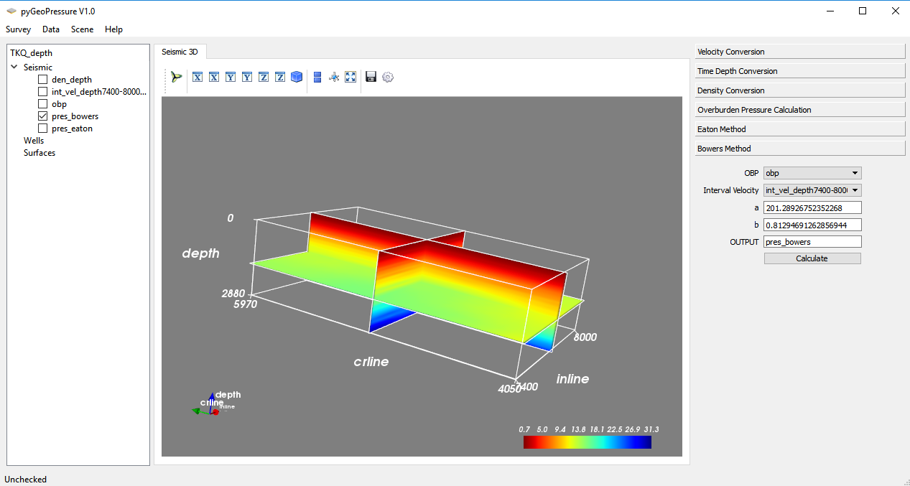

# GUI for pyGeoPressure

[](https://waffle.io/whimian/pyGeoPressure_gui)

GUI built on PyQt4 for pyGeoPressure



# Usage

As a user:

```bash
python app.py
```

As a developer:

On Windows PowerShell

```powershell
& mkpyqt.bat
```
